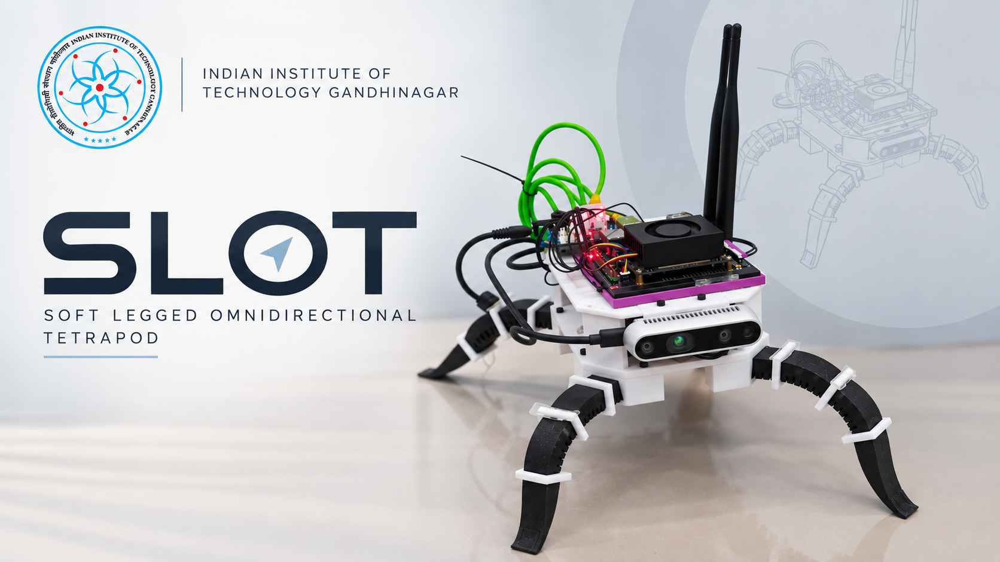

# SLOT

<p align="center">
  
</p>

## Soft-Legged Omnidirectional Tetrapod

SLOT is a soft-legged omnidirectional robot research platform. This repository brings together 3D motion planning, offline reinforcement learning, deployment experiments, trajectory analysis, AR overlays, and CAD models.

The main navigation workflow combines a 3D Rapidly-exploring Random Tree (RRT) planner for global trajectories with Double Deep Q-Network (DDQN) components for learned control and obstacle-avoidance experiments.

## Repository Layout

```text
SLOT-Offline-RL/
├── CAD/                         CAD parts and assemblies
├── Dataset_and_plots/           Datasets, logs, and paper figures
├── Dynamic_Obstacle_Avoidance/ Dynamic-obstacle deployment code
├── Global_Planner_3D_RRT/      3D planning and AR overlay code
├── my_robot_ws/                Robot-control and training workspace
├── RL/                         Training and data-collection scripts
├── slot.png                    Project image
└── README.md
```

The main subdirectories contain the following working areas:

- `CAD/CAD/`: SolidWorks parts and assemblies.
- `Dataset_and_plots/`: Experiment datasets, logs, and plotting scripts.
- `Dynamic_Obstacle_Avoidance/`: Dynamic-obstacle deployment code.
- `Global_Planner_3D_RRT/`: The RRT core, trajectory generators, AR overlays, and generated planner outputs.
- `my_robot_ws/`: Robot-control utilities and additional training/deployment code.
- `RL/`: Training, data collection, checkpoints, and RL logs.

## Requirements

The exact dependencies depend on the workflow. The planning, plotting, and data-processing scripts use packages such as:

```bash
pip install numpy scipy matplotlib opencv-python pandas
```

The RL and deployment scripts also use PyTorch and the Dynamixel SDK:

```bash
pip install torch dynamixel-sdk
```

Robot deployment additionally requires a configured ROS 2 environment, camera drivers, Dynamixel hardware, and the associated runtime configuration. These platform-specific dependencies are not bundled with this repository.

## Getting Started

Clone the repository and create or activate a Python environment before installing dependencies:

```bash
git clone https://github.com/Saumya-Karan/SLOT-Offline-RL.git
cd SLOT-Offline-RL
```

### Generate a 3D trajectory

The planner scripts are in `Global_Planner_3D_RRT/3D_Plots_and_json/` and use the implementation in `Global_Planner_3D_RRT/core/`.

```bash
cd Global_Planner_3D_RRT/3D_Plots_and_json
python plot_traj1.py
```

The available trajectory generators are `plot_traj1.py` through `plot_traj7.py`. They open a Matplotlib visualization and write their generated map data to the planner output directory.

### Generate plots

Run the plotting script from its directory because it reads experiment files using relative paths:

```bash
cd Dataset_and_plots
python all_plots.py
```

Figures are written to `Dataset_and_plots/plots_for_paper/`.

### Train or collect data

The primary RL scripts are in `RL/`:

```bash
cd RL
python train_dqn.py
```

Review each script's configuration before starting a run. Training and collection may read or update datasets, model checkpoints, and log files in that directory.

### Run deployment experiments

Deployment-related code is available in:

- `Dynamic_Obstacle_Avoidance/slot_deployment.py`
- `my_robot_ws/training/SLOT_Deployment_3D_RRT/slot_deployment.py`

These scripts expect robot hardware, ROS 2 sensor topics, a compatible model checkpoint, and generated map data. Verify the paths and hardware settings in the selected script before running it.

```bash
python Dynamic_Obstacle_Avoidance/slot_deployment.py
```

Do not run deployment code on hardware without checking motor IDs, serial-port settings, gait commands, and emergency-stop procedures.

### Generate AR overlays

The AR scripts are in `Global_Planner_3D_RRT/AR_Video_Overlays/`. They use interactive OpenCV calibration and require the corresponding raw video or image inputs under a local `raw_media/` directory.

```bash
cd Global_Planner_3D_RRT/AR_Video_Overlays
python overlay_traj1.py
```

## Hardware Notes

The deployment code includes Dynamixel motor control and ROS 2 subscriptions for camera and odometry data. Serial-port names, baud rates, motor IDs, topic names, model paths, and map paths are defined in the individual scripts and must be adapted to the target robot.

## Research Context

This repository supports research on autonomous navigation for soft-legged omnidirectional robots using classical planning and offline reinforcement learning. The checked-in scripts represent several experiments and deployment configurations; they are not a single turnkey production stack.

## Citation

If you use this repository or the associated method in your research, cite the accompanying paper:

```bibtex
@article{slot_offline_rl,
  title={Autonomous Navigation of a Soft-Legged Omnidirectional Tetrapod via Offline Behavior-Regularized Double Deep Q-Network},
  author={Saumya Karan and collaborators},
  journal={},
  year={}
}
```
